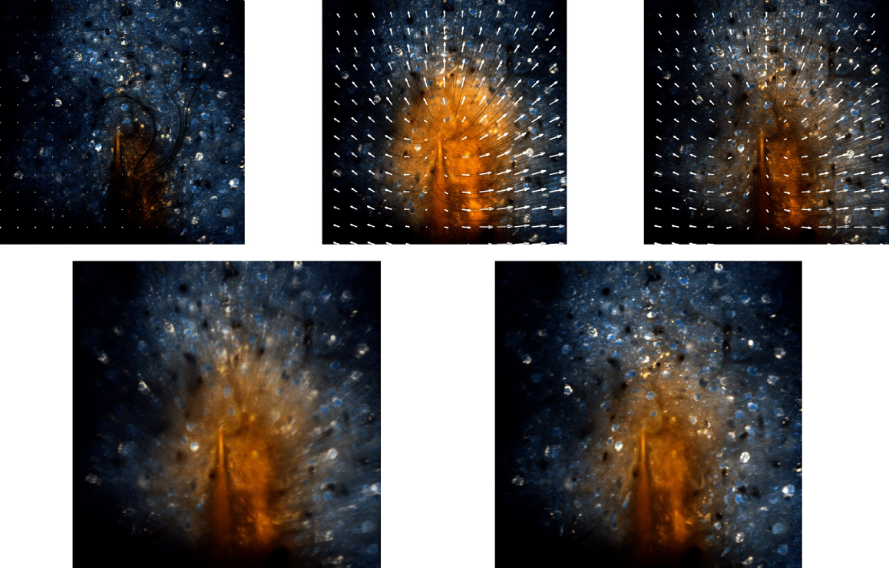

# Flow-Registration: Optical flow based motion compensation / video stabilization / registration for 2-photon imaging data

The code is written in Matlab, Java (IJ Plugin) and C++. The preprint of our paper can be found on [bioRxiv](https://www.biorxiv.org/content/10.1101/2021.07.25.453381v1) and the project website [here](https://www.snnu.uni-saarland.de/flow-registration/).




## Download

The code for the toolbox will launch here after peer-review of our paper, please [contact us](mailto:Philipp.Flotho@uni-saarland.de) for more details. 

## Citation

Details on the method and video results can be found [here](http://www.snnu.uni-saarland.de/flow-registration/).

If you use parts of this code or the plugin for your work, please cite
  
> P. Flotho, S. Nomura, B. Kuhn and D. J. Strauss, “Software for Non-Parametric Image Registration of 2-Photon Imaging Data,” [bioRxiv](https://www.biorxiv.org/content/10.1101/2021.07.25.453381v1), 2021.

BibTeX entry
```
@article{flotea2021c,
    author = {Flotho, P. and Nomura, S. and Kuhn, B. and Strauss, D. J.},
    title = {Software for Non-Parametric Image Registration of 2-Photon Imaging Data},
	elocation-id = {2021.07.25.453381},
	year = {2021},
	doi = {10.1101/2021.07.25.453381},
    publisher = {Cold Spring Harbor Laboratory},
    journal = {bioRxiv}
}
```